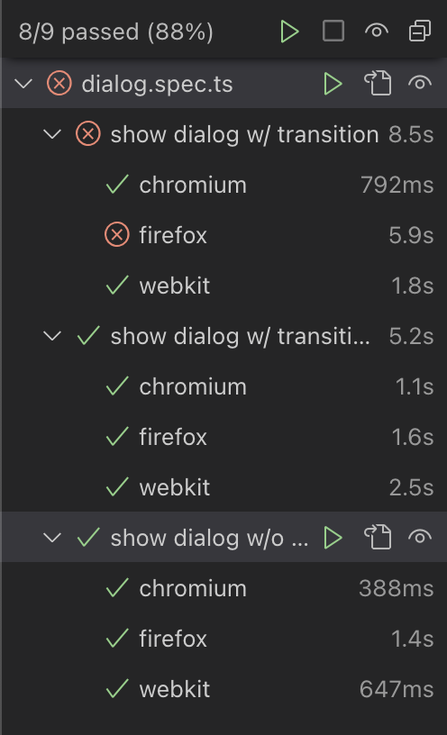

## How-to run PoC test cases?

Below shell commands will open the browser and open up the Playwright test page.

```
$ cd ${PROJECT_DIR}
$ npm install
$ npx playwright install --with-deps
$ npm test
```

The following three test cases are defined in [tests/dialog.spec.ts](./tests/dialog.spec.ts). All cases are supposed to pass.

1. show dialog w/ transition
1. show dialog w/ transition, wait for opacity to be 1
1. show dialog w/o transition

Inside the test page, select all projects(chromium, firefox and webkit) and run all test cases.

## Test Result

The test result will look like below.



Tests will pass except the first test case with Firefox browser.
